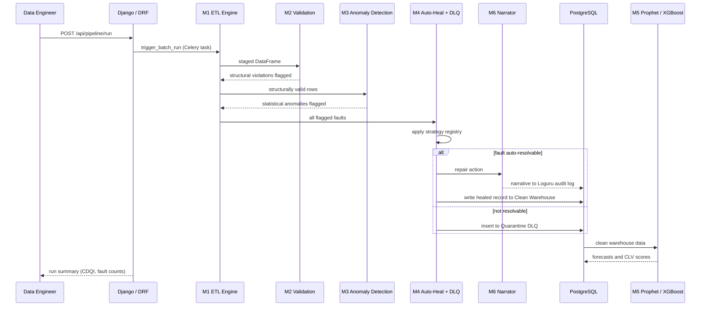
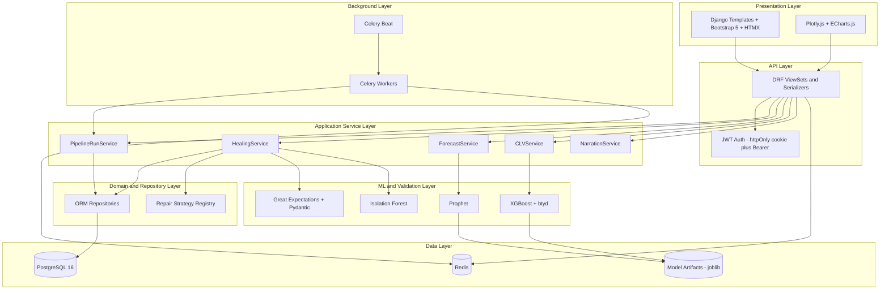

# DataXAi Engineering Handbook
## Volume 1 — Foundations: Project Understanding, Requirements, Research Design, Architecture & Technology Decisions

**Project:** DataXAi — Auto-heal ETL Pipelines & Predictive Analytics Platform for Pakistani E-Commerce SMEs
**Team:** M Arslan Ahmad (FSD-FL-217) · Fatima Munawar (FSD-FL-211)
**Supervisor:** Mr. Usama Shahzore — Dept. of Software Engineering, NUML Faisalabad Campus
**Source of truth:** DataXAi FYP Proposal, May 2026 (declared 23 June 2026)

---

## How This Handbook Is Structured

Your original brief asked for 18 volumes of 80–120 pages each. That's kept — the breakdown is genuinely good, it maps cleanly onto your seven modules (M1–M7) plus the supporting infrastructure. What's changed is the definition of "done": each volume is complete at whatever length its content actually needs, not padded to a page count. Starting Volume 2, "complete" also means real files in a real Git repository, built and tested one milestone at a time — per your own closing instruction, not the "never stop" one.

Every technology decision below stays faithful to Table 4 and Table 8 of your proposal. Where the proposal is silent or internally inconsistent, Section 1.6 names the issue, gives options, and recommends one — and then the rest of this handbook just uses that recommendation, per your instructions.

---

## 1.1 Project Understanding

### The problem, restated precisely

A Pakistani e-commerce SME's batch pipeline is only as good as the data reconciled into it, and that data is dirty by construction: WhatsApp orders manually re-keyed into spreadsheets, mixed Urdu/English SKUs, duplicate transactions from retry logic over unreliable connections. Two downstream decisions inherit whatever quality that data has — demand forecasting (bad inputs → wrong reorder quantities → stockouts that cost both the sale and the seller-rating) and CLV estimation (bad inputs → biased marketing spend). The tools that already exist split into three failure modes: **detect-and-stop** (Deequ, Great Expectations, Soda, Griffin — flag but don't fix), **informal repair** (manual, unaudited, doesn't survive a monthly reconciliation with Daraz), and **invisible impact** (nothing measures whether a data-quality fix actually improved a downstream model's accuracy).

DataXAi's actual contribution is closing that loop — **detect → repair → document → measure** — and the "measure" step is what makes this a research contribution and not just a pipeline. That's why the five research contributions (C1–C5) aren't an afterthought bolted onto an engineering project; they're the thing that makes the engineering project defensible as a BSSE FYP with an IEEE Access submission attached.

### The seven modules, in one paragraph each

- **M1 — ETL Engine.** Reads CSV files and PostgreSQL source tables via SQLAlchemy 2.x, applies an alias map to rename drifted columns, coerces types, and normalizes every date to ISO 8601. Every row that passes through is counted and logged — this module's real job is producing a traceable staged DataFrame, not just moving data.
- **M2 — Data Contract Validation.** Two independent validation layers on the staged DataFrame: Great Expectations checks the dataset against a declarative expectation suite (schema, types, ranges), and Pydantic v2 checks each row against a strict typed model. They're complementary, not redundant — GE is dataset-level and produces a human-readable report; Pydantic is row-level and fails fast inside the Python code path.
- **M3 — Statistical Anomaly Detection.** Catches faults that are structurally valid but statistically wrong. Isolation Forest (contamination = 0.05, configurable via Django Admin) is fit on a clean baseline extracted from UCI Online Retail II; a per-column Z-score check (threshold 3.0) backs it up; a composite-key hash catches duplicates; a Pandas-merge check catches referential integrity violations.
- **M4 — Auto-Heal + Quarantine DLQ.** The strategy registry: every fault code maps to a repair action. Numeric gaps get Linear Regression imputation if R² > 0.6 on a clean training split, otherwise median; categorical gaps get mode; duplicates keep the most recent timestamp; schema drift resolves via the alias dictionary; anything unresolvable — most often referential integrity — goes to the PostgreSQL Quarantine DLQ with a fault code, timestamp, and recommended action, never silently guessed at.
- **M5 — Predictive Analytics.** Two models trained only on the clean warehouse, never on raw or quarantined data: a single Facebook Prophet model with weekly + annual seasonality producing 30-day SKU-level demand forecasts and reorder points, and an XGBoost regressor trained on BG/NBD-derived CLV labels plus six RFM-family features, producing a 12-month CLV estimate per customer that then gets bucketed into four percentile tiers.
- **M6 — NLP Intelligence Layer.** A Jinja2 template turns each repair action into a plain-language sentence (row, column, fault type, strategy, before/after value); when a record has multiple simultaneous faults, that template gets forwarded to Groq for a longer synthesized narrative. A separate chatbot surface answers ad-hoc questions about pipeline state over a streaming connection.
- **M7 — Django Dashboard & Security.** Five role-gated views (Pipeline Health, Quarantine Manager, Demand Forecast, CLV Intelligence, Pipeline Chatbot) behind JWT auth and three enforced roles (Data Engineer, Business Analyst, Admin), responsive across desktop/tablet/mobile.

### The actual product is the audit trail

The dashboard is the thing users see, but the thing that makes C1–C5 possible — and the thing a Daraz seller would actually trust — is that every fault caught and every value changed is logged with enough structure (row index, column, fault code, old value, new value, timestamp) to reconstruct exactly what happened to any given record. Design every module with that log entry as a first-class output, not an afterthought.

### Workflow, as a sequence

This is the same logic as your Figure 4 flow chart and Figure 2 DFD, just made concrete enough to hand to whoever writes the Celery task in Volume 4.

---

## 1.2 Requirements Analysis (Informal SRS)

The proposal never states requirements as FR/NFR — reasonable for a proposal, not reasonable for a build. Here's the derived SRS, which doubles as the requirements-engineering artifact your own Part 24, Section 24.1 asks for.

### Functional Requirements

| ID | Requirement | Module |
|---|---|---|
| FR-01 | Ingest raw transaction, customer, and inventory data from CSV files and PostgreSQL source tables | M1 |
| FR-02 | Apply alias mapping, type coercion, and ISO 8601 date normalization during transform | M1 |
| FR-03 | Validate staged data against a Great Expectations suite (schema, type, range) | M2 |
| FR-04 | Perform row-level validation with typed Pydantic v2 models | M2 |
| FR-05 | Detect statistical outliers via Isolation Forest, configurable contamination factor | M3 |
| FR-06 | Detect duplicate records via composite-key hashing | M3 |
| FR-07 | Detect referential integrity violations via cross-table validation | M3 |
| FR-08 | Apply the correct repair strategy per fault type via a strategy registry | M4 |
| FR-09 | Route unresolvable records to the Quarantine DLQ with fault code, timestamp, recommended action | M4 |
| FR-10 | Generate a 30-day SKU-level demand forecast with 80%/95% confidence bands | M5 |
| FR-11 | Compute reorder point = (avg daily demand × lead time) + safety stock | M5 |
| FR-12 | Estimate 12-month CLV per customer via XGBoost on BG/NBD-derived labels + 6 features | M5 |
| FR-13 | Segment customers into 4 CLV tiers by percentile | M5 |
| FR-14 | Generate plain-language repair narratives (Jinja2, extended via Groq for multi-fault rows) | M6 |
| FR-15 | Serve a streaming chatbot answering natural-language questions about pipeline state | M6 |
| FR-16 | Present 5 role-gated dashboard views | M7 |
| FR-17 | Enforce 3 roles (Data Engineer, Business Analyst, Admin) per the use case diagram | M7 |
| FR-18 | Allow approve / reject / edit-and-approve on quarantined records | M7 |
| FR-19 | Log every transform/validate/repair step in structured JSON with full raw-to-dashboard traceability | M1–M7 |
| FR-20 | Compute CDQI (5 ISO 25012 dimensions) before and after healing, per batch run | M4 |
| FR-21 | Support a seeded, configurable Fault Injector for controlled experiments (research only, not shipped to end users) | Research harness |

### Non-Functional Requirements

| ID | Requirement | Driver |
|---|---|---|
| NFR-01 | Single-command Docker Compose bring-up, 8 GB RAM / student-grade hardware | Scope, §5.1 |
| NFR-02 | Deterministic, rule-based repairs only — no opaque ML repair — for auditability | Limitations §3.8 |
| NFR-03 | Graceful fallback to Jinja2-only narration if Groq is unreachable; pipeline never stalls | Limitations §3.8 |
| NFR-04 | Sustain a 100,000-record load test (Locust) without failure | Gantt, Phase 3 |
| NFR-05 | Respect Groq's rate limit without blocking the pipeline | §3.8 |
| NFR-06 | JWT-based auth, RBAC per role, standard OWASP protections | Scope, M7 |
| NFR-07 | Every repair traceable: row, column, fault type, strategy, before/after value, timestamp | §3.2.4, C5 |
| NFR-08 | Deterministic, seeded, repeatable runs at controlled injection rates | §4.1, C1–C4 |
| NFR-09 | Dashboard usable across desktop/tablet/mobile | §3.2.7 |
| NFR-10 | New fault types/strategies addable without touching core pipeline logic (open/closed) | §3.2.4 "strategy registry" |

---

## 1.3 Research Design Review

### Why Design Science Research fits

Hevner et al.'s DSR paradigm is artifact-centric: you build something novel to solve an identified problem, and the artifact itself — not a separate theory — is evaluated. That's exactly this project's shape. DataXAi-the-system is the artifact; C1–C5 are the evaluation. This matters practically: your defense and your IEEE Access draft both need to frame the system as "we built X, and here is the evidence X works," not as a theory being tested.

### C1–C5, and what each one requires to actually be testable

**C1 — Dual-Layer Detection.** Hypothesis: GE + Isolation Forest together exceeds 90% recall across all 8 fault types and beats either layer alone. This requires the Fault Injector to persist **ground truth** — which row, which column, which fault type it corrupted — separately from the corrupted data itself. Without that, recall is uncomputable. Flag this now for Volume 3's schema: a `fault_injection_log(batch_id, row_id, column_name, fault_type, injected_at)` table. Ablation design: run the same injected batch through GE-only, IF-only, and GE+IF; report precision/recall/F1 per fault class with 95% CI on 1,000 injected faults.

**C2 — Composite Data Quality Index.** Hypothesis: automated repair improves CDQI by ≥30% over an unhealed baseline. Needs a paired design — same batch, same injection rate, CDQI computed before and after healing — evaluated with a paired t-test and Cohen's d.

**C3 — Fault Injection Rate vs. Forecast Accuracy.** Hypothesis: Prophet MAPE on auto-healed data is ≥15% lower than unhealed at a 10% injection rate. Table 6 asks for "mean ± SD" across 5 injection rates (0/5/10/20/30%) — that implies multiple runs per rate at different random seeds. Give the Fault Injector a `--seed` parameter from day one; retrofitting it later means re-running everything.

**C4 — Data Quality vs. CLV Accuracy.** Hypothesis: XGBoost CLV RMSE is ≥20% lower on healed data, and Pearson r between CDQI and RMSE exceeds 0.7 across the injection sweep. Reuses the exact same seeded sweep infrastructure as C3 — build it once.

**C5 — Repair Narration Evaluation.** Hypothesis: ≥80% of non-technical raters (5 raters, ≥2 Pakistani SME owners, per your Gantt) rate the narratives clear and accurate on a 5-point Likert scale. This is a human-subjects data collection task, not code — the survey instrument (Likert items, sample narratives, consent language) needs to exist and recruitment needs to start well before Month 6. Analysis: Krippendorff's alpha for inter-rater agreement, Wilcoxon signed-rank test (most likely template-only vs. Groq-augmented narratives).

None of C1–C5 are part of the seven production modules — they're a separate **Research Harness** that sits alongside M1–M5: the seeded Fault Injector, the ground-truth log, and the statistical evaluation scripts. Keeping it architecturally separate from M1–M7 matters, because the production system should never depend on the research harness being present — a real SME deployment doesn't inject synthetic faults.

---

## 1.4 System Architecture

### Layered view

The Application Service Layer is the load-bearing decision here (Section 24.6 asked for clean/layered architecture — this is it). Django views and DRF viewsets stay thin; they call a service (`PipelineRunService.trigger()`, `CLVService.score_customer()`), and the service owns orchestration. This is what lets Volume 13's tests exercise business logic without spinning up HTTP.

### Deployment view

Docker Compose services, matching Table 8 exactly: `web` (Django + DRF, served over ASGI), `worker` (Celery), `beat` (Celery Beat scheduler), `db` (PostgreSQL 16), `cache` (Redis — doubles as Celery broker and Django cache backend), `nginx` (reverse proxy + static files). One detail the proposal doesn't spell out: M6's streaming chatbot needs an **ASGI** server, not plain WSGI/Gunicorn — the standard pattern is `gunicorn config.asgi:application -k uvicorn.workers.UvicornWorker`, which keeps Gunicorn's process management while giving you async view support. This goes in Volume 2's Dockerfile.

### Data flow, in one paragraph

Raw data (E1) enters through P1 (ETL) into DS1 (staging). P2 (validation) splits records into structurally valid vs. flagged. Valid records go to P3 (anomaly detection), which flags statistical outliers. Everything flagged reaches P4 (auto-heal), which either writes to DS2 (clean warehouse) or DS3 (quarantine). P6 (NLP layer) narrates every repair; P7 (Loguru) logs everything to DS4. P5 (predictive analytics) reads only DS2. P8 (Django dashboard) serves E2 (authenticated users), who can act on DS3, closing the loop back into the pipeline. This is your Figure 2, just restated as the thing Volume 4 onward will actually implement.

---

## 1.5 Technology Stack Decisions

For each: why chosen, what was rejected, and — where relevant — what's changed since the proposal was written.

- **Django 5.2 LTS (proposal specified 4.2 LTS) + DRF 3.15.** Django's ORM/Admin/migrations/auth-framework combination is the reason to pick it over Flask or FastAPI here specifically: M3 explicitly needs a working Django Admin to make Isolation Forest's contamination factor configurable without writing a custom settings UI, and FastAPI has no admin at all. 4.2 LTS is past end-of-life as of this month; 5.2 LTS is the current LTS with a longer support runway and needs Python 3.10+, which is compatible with everything else pinned here. This is a version substitution, not a design change — everything the proposal describes still applies to 5.2.
- **PostgreSQL 16.** JSONB for fault metadata, ACID guarantees for the audit trail, mature indexing for the quarantine table. MySQL's JSON support is weaker for this use case; SQLite doesn't hold up under the 100k-record load test.
- **Great Expectations (GX Core 1.0+, fluent API) + Pydantic v2.** The proposal's 0.18 pin is dead — GX dropped support for it entirely in October 2025, and the whole configuration API changed (declarative YAML-adjacent config → `context.data_sources.add_pandas()`, typed `ExpectationSuite` objects). Pin `great-expectations>=1.0,<2.0` instead. GE stays for dataset-level, human-readable expectation reporting (this is what a Business Analyst reads); Pydantic stays for fast, strict, code-path row validation. They were never redundant — different consumers, different granularity.
- **Isolation Forest (scikit-learn).** Unsupervised — you have no labeled fault data to train a classifier on. O(n log n), no distributional assumptions, and it's exactly the algorithm your own C1 hypothesis is built around, so there's no alternative worth seriously considering here.
- **Facebook Prophet.** Handles missing data natively — important because even healed data can have gaps — and needs no manual ARIMA-style (p,d,q) tuning, which matters on a 2-person, 7-month timeline. Decomposable trend/seasonality also feeds directly into the "explain this forecast to an SME owner" goal in a way an LSTM's internals never would. An LSTM was rejected for the same reason a bigger team would consider it: more data, more tuning, more compute, less interpretability, for a marginal accuracy gain that doesn't matter at this dataset size.
- **XGBoost 2.x + `btyd` (proposal specified `lifetimes`).** `lifetimes` is archived — the maintainer's own README points to a successor. Two real options: **PyMC-Marketing** (the "official" successor, Bayesian, gives full posterior uncertainty on CLV, but pulls in PyMC + PyTensor + ArviZ — heavy for student hardware and a bigger learning curve mid-FYP) or **`btyd`** (a lighter, more direct successor that reimplements the same frequentist BG/NBD `BetaGeoFitter` API `lifetimes` had, with Bayesian variants optional rather than required). `btyd` is the better fit here — same MLE-based workflow the proposal describes, minimal migration cost, no new heavy dependencies. Keep PyMC-Marketing noted as the natural "Future Work" upgrade if you want CLV confidence intervals later. XGBoost itself needs no substitution — you've already got the GridSearchCV + from-scratch-vs-library validation workflow down from your ML mastery repo, so the tuning step here will feel familiar.
- **Groq (model updated; API choice unchanged).** Groq's free-tier LPU inference speed is still the reason to use it over OpenAI/Anthropic for this specific role — chatbot latency matters for UX, and the proposal's own fallback design already assumes rate-limit pressure. But `llama-3.3-70b-versatile` and `llama-3.1-8b-instant` were both deprecated by Groq on June 17, 2026. Use `openai/gpt-oss-120b` for the repair-narrative synthesis (better quality, narration isn't latency-critical) and `openai/gpt-oss-20b` for the interactive chatbot (faster, chat responsiveness matters more than depth). Same API shape, same fallback logic, different model string.
- **Loguru 0.7.** Simpler sink/rotation API than stdlib `logging`, structured JSON output out of the box — exactly what the audit trail needs, no reason to reconsider.
- **Docker Compose (not Kubernetes).** This is a direct rejection of your own meta-prompt's Section 24.13 wishlist (blue-green/canary deployment, K8s-style orchestration). Compose matches NFR-01 — single command, student hardware, one VM. Blue-green and canary deployment require multiple replicas behind a load balancer, which a one-VM Compose deployment structurally can't do. Your own proposal already defers the analogous heavier infrastructure (Kafka streaming) to Future Work — the same reasoning applies here, and it's the same argument you'd need to make out loud in a viva.
- **Celery + Redis.** Redis serves double duty as Celery's broker and Django's cache backend — already justified by Table 8, no added dependency. Celery over `django-q`/RQ/APScheduler because it's the most Django-integrated, most documented option, and you'll want it for scheduled/background ETL runs and model retraining regardless.
- **Frontend: Django templates + Bootstrap 5 + HTMX + Plotly.js/ECharts.js (not a separate SPA).** Your own mockups were built in "basic html, css" — that's a server-rendered app, not a React SPA. A separate frontend means a separate build pipeline, a separate deployment target, and a second framework a viva examiner can ask about. HTMX gets you partial-page updates (approve/reject a DLQ row, refresh a chart) without needing a JS framework at all. This is a KISS/YAGNI call your own Section 24.6 explicitly asks for.

---

## 1.6 Ambiguities Found & Engineering Decisions

Per your instructions: issue, options, recommendation, reasoning.

**1. SSE delivery mechanism.** Table 4 (M6) says "Django Channels SSE"; §3.2.6's prose says "a Django asynchronous view." These are different architectures — Channels is built for WebSocket consumer/routing/channel-layer patterns; SSE is one-directional server push. *Options:* (a) full Django Channels with a Redis channel layer, or (b) a native async Django view returning `StreamingHttpResponse`, polling the DB/log store on an interval. *Recommendation:* (b). It matches the proposal's own prose more closely than its table, needs no channel-layer machinery for a one-directional feed, and if you ever need true multi-client broadcast later, Redis (already in the stack for Celery) is a same-effort upgrade path — you're not painting yourself into a corner, just not building for a requirement you don't have yet.

**2. Charting library.** Table 8 says "Plotly Dash + Apache ECharts." Plotly *Dash* is a full app framework with its own Flask server — running it inside a Django app means running two web frameworks that both want to own routing. *Recommendation:* Plotly.js (the JS charting library, not Dash) + ECharts.js, both loaded client-side inside Django templates. This produces the exact same visuals (confidence-band forecast charts, CDQI gauge, CLV donut) your mockups describe, with zero extra server process.

**3. JWT delivery mechanism.** The proposal is explicit that the *dashboard itself* is JWT-secured (§3.1, §3.2.7) — not just the API. It doesn't say *how* the JWT reaches the browser. The common naive pattern (JWT in `localStorage`, read by JS, sent as a Bearer header) is a known XSS-exposure anti-pattern for anything server-rendered. *Recommendation:* issue the same JWTs via SimpleJWT, but deliver them to browser sessions as **httpOnly cookies** (validated by a custom DRF authentication class + Django middleware), with CSRF protection still applied to state-changing requests. Programmatic/API clients (and the Daraz/Shopify connectors mentioned in Future Work) use the identical tokens as Bearer headers. This satisfies the proposal's explicit JWT requirement while closing the storage gap it left open.

**Decisions made explicit (smaller, but worth pinning down now):**
- The "six RFM features" (Recency, Frequency, Monetary, purchase velocity, return rate, product diversity index) are a genuine extension beyond classic 3-feature RFM — make sure the customer feature table in Volume 3 has all six columns, and dashboard copy doesn't just say "RFM" without qualification.
- CLV tier thresholds aren't specified. Recommendation: quartile-based — top 25% = Champions, 50–75% = Loyal, 25–50% = At-Risk, bottom 25% = Lost — configurable, not hardcoded, since an SME owner may want to adjust tier sensitivity later.

---

## 1.7 Team Workload Mapping (from Table 7)

| Modules / Volumes | Owner |
|---|---|
| M1 ETL, M2 Validation, M7 Dashboard UI/UX | Fatima (Pipeline & Dashboard Lead) |
| M3 Anomaly Detection, M5 Forecasting + CLV, Research Contributions C1–C5 | Arslan (ML/AI Lead) |
| M4 Auto-Heal, M6 NLP, Database/Auth/DevOps | Shared — not explicitly split in Table 7 |

Worth syncing on before Volume 2: whether you're building in one shared repo from day one or merging branches later.

---

## Summary

DataXAi is a detect-repair-document-measure loop, not just an ETL pipeline — the audit trail and the C1–C5 evaluation are the actual deliverable, not add-ons. Seven production modules (M1–M7) plus a separate, non-shipped Research Harness. Architecture is a Django monolith (templates + DRF, service layer between views and ML/repositories), Docker Compose deployment, no infrastructure beyond what NFR-01 requires. Three ambiguities resolved (SSE mechanism, charting library, JWT delivery), four dependency versions updated to what's actually current (Django 5.2 LTS, GX Core 1.0+, Groq gpt-oss models, `btyd`), all without changing anything the proposal actually committed to.

## Viva & Technical Interview Prep

1. Why Isolation Forest instead of a supervised classifier, given no labeled fault data exists at training time?
2. Walk me through why a referential-integrity violation gets quarantined but a missing value gets auto-repaired.
3. How do you know auto-heal actually improved things, rather than moving corrupted data downstream in a different shape?
4. Why Prophet over ARIMA or an LSTM for the demand forecast?
5. What happens to a live pipeline run if the Groq API times out mid-batch?
6. CDQI has five ISO 25012 dimensions — how is "timeliness" actually computed for a batch job, not a streaming one?
7. Why quartile-based CLV tiers instead of k-means clustering on the RFM features?
8. If I asked you to add a 9th fault type tomorrow, which files would you touch — and which would you not have to touch?
9. Your JWTs secure the dashboard — where are they stored client-side, and what stops them being stolen via XSS?

## Before You Start Volume 2

- [ ] Create the GitHub repo (empty is fine — Volume 2 populates it)
- [ ] Install Docker Desktop, confirm `docker compose version` runs
- [ ] Install Python 3.11 (matches the pinned dependency set) via pyenv or your OS package manager
- [ ] Get a Groq API key at console.groq.com — free tier is enough for development
- [ ] Download the UCI Online Retail II dataset (id 502) yourself and keep it local — this sandbox's network allowlist doesn't include archive.ics.uci.edu (it's scoped to package registries), so when we reach Volume 4 you'll need to upload the file to our chat, or fetch it directly from a local dev environment like Claude Code, which has normal network access
- [ ] Sync with Fatima on repo ownership per §1.7 above

## Appendix A: Full Volume Roadmap

| Vol | Title | Key Deliverable | Primary Owner |
|---|---|---|---|
| 1 | Foundations | This document | Both |
| 2 | Environment, Repo, Docker, CI/CD, Django bootstrap | Real repo skeleton | Both |
| 3 | Database, Auth, Core backend | Migrations, models, RBAC | Both |
| 4 | Data Engineering Pipeline (M1) | ETL engine | Fatima |
| 5 | Data Validation Engine (M2) | GE suite + Pydantic models | Fatima |
| 6 | Auto-Healing Engine (M4) | Strategy registry + DLQ | Shared |
| 7 | Anomaly Detection Engine (M3) | Isolation Forest pipeline | Arslan |
| 8 | Forecasting Engine (M5 – Prophet) | Demand forecast + reorder points | Arslan |
| 9 | CLV Engine (M5 – XGBoost) | CLV model + segmentation | Arslan |
| 10 | REST APIs | DRF endpoints, OpenAPI | Both |
| 11 | Dashboard Frontend (M7) | 5 views | Fatima |
| 12 | NLP Chatbot (M6) | Narrator + SSE chatbot | Shared |
| 13 | Testing | pytest + Locust suites | Both |
| 14 | Deployment | Docker Compose prod, Nginx | Both |
| 15 | Production Hardening | Security pass, rate limiting | Both |
| 16 | Research Evaluation | C1–C5 results, stats, figures | Arslan |
| 17 | Documentation | README, ADRs, Sphinx docs | Both |
| 18 | Final Repository Review | Release, viva prep | Both |

## References

Continuing your proposal's numbering where reused: Hevner et al. [10], ISO/IEC 25012 [16], Liu/Ting/Zhou (Isolation Forest) [6], Taylor/Letham (Prophet) [7], Fader/Hardie/Lee (BG/NBD) [12].

New for this volume:
- Django Software Foundation — Django supported versions & release policy, docs.djangoproject.com
- Great Expectations — "Changes to know for GX Core 1.0" and 0.18 sunset notice, greatexpectations.io/blog
- Groq — Model Deprecation notices, console.groq.com/docs/deprecations
- CamDavidsonPilon/lifetimes — archived-mode notice, github.com/CamDavidsonPilon/lifetimes; ColtAllen/btyd successor, pypi.org/project/btyd
- Krippendorff, K. — *Content Analysis: An Introduction to Its Methodology* (standard citation for the Krippendorff's alpha your C5 methodology already uses)
