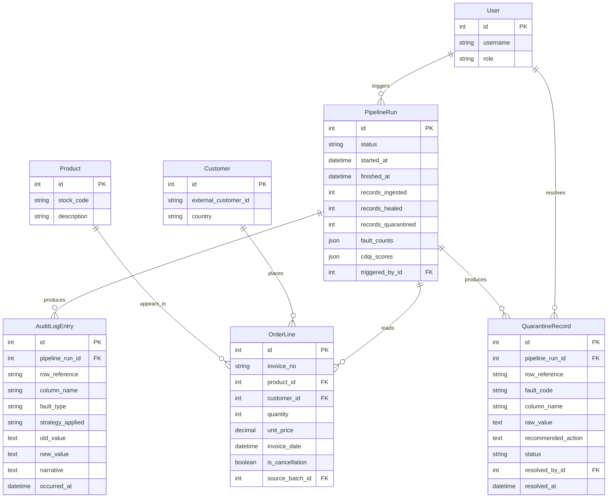

# DataXAi Engineering Handbook
## Volume 3 — Database Design, Authentication, Authorization & Core Backend Infrastructure

*Format from here on: design recap, then every file complete (no snippets), then verification — per your instructions.*

---

## 3.1 Recap: What This Volume Builds And Why

Volume 3 turns three things from Volume 1's plan into real, migrated database tables: the ER diagram you asked for, RBAC on top of the `role` field Volume 2 added but never enforced, and the cross-cutting infrastructure (exceptions, pagination) that Volumes 4–12 will all import rather than reinvent.

**One new app: `warehouse`.** The proposal's Figure 2 DFD names `DS2: Clean Warehouse` as a data store but never assigns it to one of M1–M7 — nothing in Table 4 is described as "owns the Customer/Product/Transaction tables." Rather than bolt those onto `etl` (which is about *moving* data, not modeling it) or `core` (reserved for base classes, not concrete domain tables), a dedicated `warehouse` app is the cleanest home. Same pattern as Volume 1's ambiguity-handling: name the gap, pick the option that keeps single responsibility intact, move on.

**Four design decisions worth knowing before you read the code:**

1. **`OrderLine.quantity` can be negative; `OrderLine.unit_price` cannot.** UCI Online Retail II encodes returns/cancellations as negative-quantity rows (invoice numbers prefixed `C`) — that's legitimate business data your `return_rate` CLV feature (Section 3.2.5 of the proposal) directly depends on. A negative *price*, on the other hand, is Table 1's "Range Violation" fault type — a real error. The DB enforces this distinction with a `CheckConstraint` on price only; a test (`test_negative_quantity_is_allowed_for_returns`) exists specifically so nobody "fixes" this into a bug later.
2. **RBAC treats Admin as a superset**, not a fourth independent role. `HasRole.has_permission()` short-circuits to `True` for any Admin regardless of `allowed_roles` — matching the `<<extend>>` relationships around the Admin actor in the proposal's use case diagram (Figure 3), where Admin's use cases sit on top of, not beside, the other two roles'.
3. **`AuditLogEntry` is a DB-queryable mirror, not a replacement, for Loguru's file-based log.** The proposal is explicit that Loguru is the structured JSON audit trail (Section 3.2, Table 4/M7). This table exists only so the "View Repair Audit Trail" dashboard view (use case diagram) can filter/sort/paginate without parsing log files per request. Volume 4 onward, both get written on every repair.
4. **`QuarantineRecord.resolve()` is the only path to changing its status.** Approve, reject, and edit-and-approve (all three DLQ actions from the use case diagram) go through one method that sets `status`, `resolved_by`, `resolved_at`, and `resolution_notes` together and refuses to run twice. This is a small thing that prevents a real bug class: a view or Celery task setting `status` directly and forgetting `resolved_by`.

**Deliberately not built yet:** `forecasting` and `clv` apps are untouched — still the Volume 2 placeholder. Their real fields depend on exactly what Prophet's and XGBoost's output objects look like, which won't be known with certainty until Volumes 8–9 are actually writing inference code. Designing that schema now would be guessing; the apps already exist and are migration-ready, so nothing about `INSTALLED_APPS` needs to change when that guess gets replaced with the real thing.


## 3.2 Design-to-File Map

## 3.3 Every File, Complete

## 3.3.1 New app: `warehouse` — the Clean Warehouse (DS2)

**`apps/warehouse/apps.py`** — NEW

Auto-generated by `startapp`; included for completeness.

```python
from django.apps import AppConfig


class WarehouseConfig(AppConfig):
    default_auto_field = "django.db.models.BigAutoField"
    name = "warehouse"
```

**`apps/warehouse/models.py`** — NEW

Customer, Product, OrderLine — see recap for the negative-quantity-vs-negative-price reasoning.

```python
"""
The Clean Warehouse (DS2 in the proposal's Figure 2 DFD). Only M4 (healing)
writes here, and only after a record has passed validation/detection/repair
- nothing upstream of the Auto-Heal module ever touches these tables.

Grain note: UCI Online Retail II is order-*line* grained (one row per
invoice + stock code), not one row per invoice - OrderLine reflects that,
not "Order".
"""

from django.db import models

from core.models import TimeStampedModel


class Customer(TimeStampedModel):
    """
    One row per source CustomerID. `external_customer_id` (not `id`) is
    what the source system/ETL refers to - UCI Online Retail II ships some
    blank CustomerIDs (guest-like transactions), so this is nullable and
    OrderLine.customer is nullable too.
    """

    external_customer_id = models.CharField(max_length=32, unique=True, db_index=True)
    country = models.CharField(max_length=64, blank=True)

    class Meta:
        ordering = ["external_customer_id"]

    def __str__(self):
        return f"Customer({self.external_customer_id})"


class Product(TimeStampedModel):
    """One row per StockCode (SKU). Description can legitimately vary
    slightly across source rows for the same StockCode in the raw UCI
    data (free-text entry) - the ETL layer (Volume 4) is responsible for
    picking a canonical description; this table stores the result."""

    stock_code = models.CharField(max_length=32, unique=True, db_index=True)
    description = models.CharField(max_length=255, blank=True)

    class Meta:
        ordering = ["stock_code"]

    def __str__(self):
        return f"Product({self.stock_code})"


class OrderLine(TimeStampedModel):
    """
    One healed, validated row of transaction data. `is_cancellation` is
    set by the ETL layer from the source InvoiceNo convention (a leading
    "C") rather than inferred here, so this table stays a plain data
    store with no business logic in it.

    `quantity` is intentionally NOT constrained to be non-negative -
    negative quantities are legitimate returns/cancellations in this
    dataset, not a data quality fault (see Volume 1, Section 1.6 "RFM"
    note: return rate is one of the six CLV features and depends on
    exactly these negative-quantity rows existing).
    """

    invoice_no = models.CharField(max_length=32, db_index=True)
    product = models.ForeignKey(Product, on_delete=models.PROTECT, related_name="order_lines")
    customer = models.ForeignKey(
        Customer, on_delete=models.PROTECT, related_name="order_lines", null=True, blank=True
    )
    quantity = models.IntegerField()
    unit_price = models.DecimalField(max_digits=12, decimal_places=4)
    invoice_date = models.DateTimeField(db_index=True)
    is_cancellation = models.BooleanField(default=False)
    source_batch = models.ForeignKey(
        "etl.PipelineRun",
        on_delete=models.SET_NULL,
        null=True,
        blank=True,
        related_name="order_lines",
        help_text=(
            "Which pipeline run loaded this row - full raw-to-dashboard " "traceability (NFR-07)."
        ),
    )

    class Meta:
        ordering = ["-invoice_date"]
        indexes = [
            models.Index(
                fields=["product", "invoice_date"]
            ),  # Prophet's SKU-level daily aggregation
            models.Index(fields=["customer", "invoice_date"]),  # RFM feature computation
        ]
        constraints = [
            models.CheckConstraint(
                condition=models.Q(unit_price__gte=0),
                name="orderline_unit_price_non_negative",
            ),
        ]

    def __str__(self):
        return f"OrderLine(invoice={self.invoice_no}, sku={self.product_id})"
```

**`apps/warehouse/admin.py`** — NEW

Read-only-ish admin registration for debugging/spot-checking loaded data.

```python
from django.contrib import admin

from .models import Customer, OrderLine, Product


@admin.register(Customer)
class CustomerAdmin(admin.ModelAdmin):
    list_display = ("external_customer_id", "country", "created_at")
    search_fields = ("external_customer_id", "country")
    list_filter = ("country",)


@admin.register(Product)
class ProductAdmin(admin.ModelAdmin):
    list_display = ("stock_code", "description")
    search_fields = ("stock_code", "description")


@admin.register(OrderLine)
class OrderLineAdmin(admin.ModelAdmin):
    list_display = (
        "invoice_no",
        "product",
        "customer",
        "quantity",
        "unit_price",
        "invoice_date",
        "is_cancellation",
    )
    list_filter = ("is_cancellation",)
    search_fields = ("invoice_no", "product__stock_code", "customer__external_customer_id")
    date_hierarchy = "invoice_date"
    raw_id_fields = ("product", "customer", "source_batch")
```

**`apps/warehouse/migrations/0001_initial.py`** — NEW (auto-generated)

Produced by `manage.py makemigrations warehouse` — don't hand-edit, regenerate if models change.

```python
# Generated by Django 5.2.16 on 2026-07-12 15:00

import django.db.models.deletion
from django.db import migrations, models


class Migration(migrations.Migration):

    initial = True

    dependencies = [
        ('etl', '0001_initial'),
    ]

    operations = [
        migrations.CreateModel(
            name='Customer',
            fields=[
                ('id', models.BigAutoField(auto_created=True, primary_key=True, serialize=False, verbose_name='ID')),
                ('created_at', models.DateTimeField(auto_now_add=True)),
                ('updated_at', models.DateTimeField(auto_now=True)),
                ('external_customer_id', models.CharField(db_index=True, max_length=32, unique=True)),
                ('country', models.CharField(blank=True, max_length=64)),
            ],
            options={
                'ordering': ['external_customer_id'],
            },
        ),
        migrations.CreateModel(
            name='Product',
            fields=[
                ('id', models.BigAutoField(auto_created=True, primary_key=True, serialize=False, verbose_name='ID')),
                ('created_at', models.DateTimeField(auto_now_add=True)),
                ('updated_at', models.DateTimeField(auto_now=True)),
                ('stock_code', models.CharField(db_index=True, max_length=32, unique=True)),
                ('description', models.CharField(blank=True, max_length=255)),
            ],
            options={
                'ordering': ['stock_code'],
            },
        ),
        migrations.CreateModel(
            name='OrderLine',
            fields=[
                ('id', models.BigAutoField(auto_created=True, primary_key=True, serialize=False, verbose_name='ID')),
                ('created_at', models.DateTimeField(auto_now_add=True)),
                ('updated_at', models.DateTimeField(auto_now=True)),
                ('invoice_no', models.CharField(db_index=True, max_length=32)),
                ('quantity', models.IntegerField()),
                ('unit_price', models.DecimalField(decimal_places=4, max_digits=12)),
                ('invoice_date', models.DateTimeField(db_index=True)),
                ('is_cancellation', models.BooleanField(default=False)),
                ('customer', models.ForeignKey(blank=True, null=True, on_delete=django.db.models.deletion.PROTECT, related_name='order_lines', to='warehouse.customer')),
                ('source_batch', models.ForeignKey(blank=True, help_text='Which pipeline run loaded this row - full raw-to-dashboard traceability (NFR-07).', null=True, on_delete=django.db.models.deletion.SET_NULL, related_name='order_lines', to='etl.pipelinerun')),
                ('product', models.ForeignKey(on_delete=django.db.models.deletion.PROTECT, related_name='order_lines', to='warehouse.product')),
            ],
            options={
                'ordering': ['-invoice_date'],
                'indexes': [models.Index(fields=['product', 'invoice_date'], name='warehouse_o_product_6117aa_idx'), models.Index(fields=['customer', 'invoice_date'], name='warehouse_o_custome_9304cd_idx')],
                'constraints': [models.CheckConstraint(condition=models.Q(('unit_price__gte', 0)), name='orderline_unit_price_non_negative')],
            },
        ),
    ]
```

**`apps/warehouse/tests/test_models.py`** — NEW

4 tests, including the constraint tests.

```python
from decimal import Decimal

import pytest
from django.db import IntegrityError, transaction

from warehouse.models import Customer, OrderLine, Product


@pytest.mark.django_db
class TestWarehouseModels:
    def test_create_customer_product_orderline(self):
        customer = Customer.objects.create(external_customer_id="17850", country="United Kingdom")
        product = Product.objects.create(
            stock_code="85123A", description="WHITE HANGING HEART T-LIGHT HOLDER"
        )
        line = OrderLine.objects.create(
            invoice_no="536365",
            product=product,
            customer=customer,
            quantity=6,
            unit_price=Decimal("2.55"),
            invoice_date="2010-12-01T08:26:00Z",
        )
        assert line.pk is not None
        assert line.is_cancellation is False
        assert customer.order_lines.count() == 1

    def test_negative_quantity_is_allowed_for_returns(self):
        """Negative quantity = a return/cancellation, a legitimate business
        record, not a data quality fault - see Volume 3 model docstring."""
        product = Product.objects.create(stock_code="22423", description="REGENCY CAKESTAND 3 TIER")
        line = OrderLine.objects.create(
            invoice_no="C536379",
            product=product,
            customer=None,
            quantity=-1,
            unit_price=Decimal("12.75"),
            invoice_date="2010-12-01T09:41:00Z",
            is_cancellation=True,
        )
        assert line.quantity == -1

    def test_negative_unit_price_is_rejected(self):
        """Unlike quantity, a negative price is a genuine fault (Table 1:
        Range Violations) - the DB constraint should reject it outright."""
        product = Product.objects.create(stock_code="99999", description="TEST SKU")
        with pytest.raises(IntegrityError):
            with transaction.atomic():
                OrderLine.objects.create(
                    invoice_no="536999",
                    product=product,
                    quantity=1,
                    unit_price=Decimal("-5.00"),
                    invoice_date="2010-12-01T10:00:00Z",
                )

    def test_customer_external_id_must_be_unique(self):
        Customer.objects.create(external_customer_id="12345", country="Pakistan")
        with pytest.raises(IntegrityError):
            with transaction.atomic():
                Customer.objects.create(external_customer_id="12345", country="Pakistan")
```

## 3.3.2 `core` — shared choices, audit log, RBAC, exceptions, pagination

**`apps/core/choices.py`** — NEW

The 8 fault types, shared by healing and core so they never drift apart.

```python
"""
Shared choice sets used by more than one app. Kept in `core` so `healing`
(QuarantineRecord) and `core` itself (AuditLogEntry) reference the exact
same 8 fault codes instead of two drifting copies of the same list.

Matches Table 1 of the proposal exactly (Data Quality Fault Taxonomy).
"""

from django.db import models


class FaultType(models.TextChoices):
    MISSING_VALUE = "missing_value", "Missing Value"
    DUPLICATE_RECORD = "duplicate_record", "Duplicate Record"
    SCHEMA_DRIFT = "schema_drift", "Schema Drift"
    STATISTICAL_OUTLIER = "statistical_outlier", "Statistical Outlier"
    TYPE_ERROR = "type_error", "Type Error"
    RANGE_VIOLATION = "range_violation", "Range Violation"
    FORMAT_INCONSISTENCY = "format_inconsistency", "Format Inconsistency"
    REFERENTIAL_INTEGRITY = "referential_integrity", "Referential Integrity Fault"
```

**`apps/core/models.py`** — UPDATE — replaces the Volume 2 version

Adds AuditLogEntry alongside the existing TimeStampedModel.

```python
from django.db import models

from core.choices import FaultType


class TimeStampedModel(models.Model):
    """Abstract base for every domain model going forward (Volumes 3-9)."""

    created_at = models.DateTimeField(auto_now_add=True)
    updated_at = models.DateTimeField(auto_now=True)

    class Meta:
        abstract = True


class AuditLogEntry(TimeStampedModel):
    """
    DB-queryable mirror of what Loguru also writes to the structured JSON
    log file (Volume 1, Section 1.1: "the actual product is the audit
    trail"). Loguru's file-based log is the durable, append-only source of
    truth for compliance/traceability; this table exists purely so the
    M7 "View Repair Audit Trail" dashboard view can filter/sort/paginate
    without parsing log files on every request.

    Every field except `pipeline_run` and `occurred_at` is blank-able:
    not every entry is about a single cell repair (a batch-level note has
    no column_name; a quarantine event has no strategy_applied).
    """

    pipeline_run = models.ForeignKey(
        "etl.PipelineRun", on_delete=models.CASCADE, related_name="audit_entries"
    )
    row_reference = models.CharField(max_length=128, blank=True)
    column_name = models.CharField(max_length=64, blank=True)
    fault_type = models.CharField(max_length=32, choices=FaultType.choices, blank=True)
    strategy_applied = models.CharField(max_length=64, blank=True)
    old_value = models.TextField(blank=True)
    new_value = models.TextField(blank=True)
    narrative = models.TextField(
        blank=True,
        help_text="Plain-language explanation from M6 (Jinja2 template, "
        "extended via Groq for multi-fault rows).",
    )
    occurred_at = models.DateTimeField(auto_now_add=True, db_index=True)

    class Meta:
        ordering = ["-occurred_at"]
        indexes = [
            models.Index(fields=["pipeline_run", "occurred_at"]),
        ]
        verbose_name_plural = "audit log entries"

    def __str__(self):
        return f"AuditLogEntry(run={self.pipeline_run_id}, row={self.row_reference})"
```

**`apps/core/permissions.py`** — NEW

RBAC. Admin-as-superset design — see recap.

```python
"""
RBAC on top of accounts.User.role (Volume 2 added the field; this is the
part that actually enforces it - Volume 1, Section 1.6's "full RBAC
enforcement is Volume 3's job" note).

Design decision: Admin is treated as a superset of every other role,
matching the <<extend>> relationships around the Admin actor in the
proposal's use case diagram (Figure 3) - an Admin can always do what a
Data Engineer or Business Analyst can, plus admin-only actions. Roles are
NOT stacked the other way: a Data Engineer cannot do Business-Analyst-only
things or vice versa unless explicitly allowed.
"""

from rest_framework.permissions import BasePermission


class HasRole(BasePermission):
    """
    Base class - subclasses set `allowed_roles`. Not used directly on a
    view; use one of the concrete subclasses below (or compose your own
    the same way for a new role combination).
    """

    allowed_roles: tuple = ()
    message = "Your role does not have access to this action."

    def has_permission(self, request, view):
        user = getattr(request, "user", None)
        if not (user and user.is_authenticated):
            return False
        if user.role == user.Role.ADMIN:
            return True
        return user.role in self.allowed_roles


class IsDataEngineer(HasRole):
    """Data Engineer only (plus Admin, via the superset rule above).
    Use for: trigger pipeline run, approve/reject DLQ, configure params."""

    def __init__(self):
        from accounts.models import User

        self.allowed_roles = (User.Role.DATA_ENGINEER,)


class IsBusinessAnalystOrAbove(HasRole):
    """Business Analyst or Data Engineer (plus Admin). Use for: read-only
    dashboard views (CDQI, forecasts, CLV, quarantine review, chatbot)."""

    def __init__(self):
        from accounts.models import User

        self.allowed_roles = (User.Role.DATA_ENGINEER, User.Role.BUSINESS_ANALYST)


class IsAdminRole(HasRole):
    """Admin only - no superset exception applies here since Admin *is*
    the role being checked. Use for: user management, purge quarantine,
    Isolation Forest configuration, system logs."""

    def __init__(self):
        self.allowed_roles = ()
```

**`apps/core/exceptions.py`** — NEW

Domain exceptions + the DRF exception handler wired into settings below.

```python
"""
Domain exceptions + a DRF exception handler that wraps every error
response (validation, permission, not-found, or an uncaught domain
exception) in one consistent JSON shape:

    {"error": {"code": "quarantine_resolution_error", "message": "..."}}

so the dashboard (M7) never has to special-case DRF's default shape vs.
a raw 500 vs. a domain error.
"""

import logging

from rest_framework import exceptions as drf_exceptions
from rest_framework.response import Response
from rest_framework.views import exception_handler as drf_default_exception_handler

logger = logging.getLogger(__name__)


class DataXAiError(Exception):
    """Base class for every domain-level exception in this project."""

    default_message = "An unexpected error occurred."
    code = "dataxai_error"

    def __init__(self, message: str | None = None):
        self.message = message or self.default_message
        super().__init__(self.message)


class QuarantineResolutionError(DataXAiError):
    default_message = "This quarantine record has already been resolved."
    code = "quarantine_resolution_error"


class InvalidRepairStrategyError(DataXAiError):
    """Raised by the strategy registry (Volume 6) for an unregistered fault code."""

    default_message = "No repair strategy is registered for this fault type."
    code = "invalid_repair_strategy"


def custom_exception_handler(exc, context):
    """
    Registered via REST_FRAMEWORK["EXCEPTION_HANDLER"]. Handles our own
    DataXAiError subclasses (which DRF doesn't know about) by converting
    them to a 400, then falls back to DRF's default handler for
    everything else (ValidationError, PermissionDenied, Http404, ...),
    and finally re-shapes whatever DRF produced into the consistent
    {"error": {...}} envelope.
    """
    if isinstance(exc, DataXAiError):
        logger.warning("DataXAiError: %s", exc.message, extra={"code": exc.code})
        return Response({"error": {"code": exc.code, "message": exc.message}}, status=400)

    response = drf_default_exception_handler(exc, context)
    if response is None:
        return None

    code = "error"
    if isinstance(exc, drf_exceptions.APIException):
        code = getattr(exc, "default_code", exc.__class__.__name__.lower())

    response.data = {"error": {"code": code, "message": _flatten_detail(response.data)}}
    return response


def _flatten_detail(detail) -> str:
    """DRF error `detail` can be a string, a list, or a nested dict of
    field errors - flatten all three into one human-readable string for
    the envelope's `message` field."""
    if isinstance(detail, (list, tuple)):
        return "; ".join(_flatten_detail(item) for item in detail)
    if isinstance(detail, dict):
        return "; ".join(f"{key}: {_flatten_detail(value)}" for key, value in detail.items())
    return str(detail)
```

**`apps/core/pagination.py`** — NEW

One pagination class, reused by every future list endpoint.

```python
"""Single pagination class reused by every list endpoint from Volume 10
onward, so page-size behaviour is identical across the whole API instead
of each viewset picking its own default."""

from rest_framework.pagination import PageNumberPagination


class StandardResultsPagination(PageNumberPagination):
    page_size = 25
    page_size_query_param = "page_size"
    max_page_size = 100
```

**`apps/core/admin.py`** — UPDATE — replaces the Volume 2 version

Registers AuditLogEntry.

```python
from django.contrib import admin

from .models import AuditLogEntry


@admin.register(AuditLogEntry)
class AuditLogEntryAdmin(admin.ModelAdmin):
    list_display = (
        "id",
        "pipeline_run",
        "row_reference",
        "fault_type",
        "strategy_applied",
        "occurred_at",
    )
    list_filter = ("fault_type", "strategy_applied")
    search_fields = ("row_reference", "column_name", "narrative")
    readonly_fields = ("occurred_at",)
    date_hierarchy = "occurred_at"
```

**`apps/core/migrations/0001_initial.py`** — NEW (auto-generated)

core's first-ever migration — it had no concrete models until this volume.

```python
# Generated by Django 5.2.16 on 2026-07-12 15:00

import django.db.models.deletion
from django.db import migrations, models


class Migration(migrations.Migration):

    initial = True

    dependencies = [
        ('etl', '0001_initial'),
    ]

    operations = [
        migrations.CreateModel(
            name='AuditLogEntry',
            fields=[
                ('id', models.BigAutoField(auto_created=True, primary_key=True, serialize=False, verbose_name='ID')),
                ('created_at', models.DateTimeField(auto_now_add=True)),
                ('updated_at', models.DateTimeField(auto_now=True)),
                ('row_reference', models.CharField(blank=True, max_length=128)),
                ('column_name', models.CharField(blank=True, max_length=64)),
                ('fault_type', models.CharField(blank=True, choices=[('missing_value', 'Missing Value'), ('duplicate_record', 'Duplicate Record'), ('schema_drift', 'Schema Drift'), ('statistical_outlier', 'Statistical Outlier'), ('type_error', 'Type Error'), ('range_violation', 'Range Violation'), ('format_inconsistency', 'Format Inconsistency'), ('referential_integrity', 'Referential Integrity Fault')], max_length=32)),
                ('strategy_applied', models.CharField(blank=True, max_length=64)),
                ('old_value', models.TextField(blank=True)),
                ('new_value', models.TextField(blank=True)),
                ('narrative', models.TextField(blank=True, help_text='Plain-language explanation from M6 (Jinja2 template, extended via Groq for multi-fault rows).')),
                ('occurred_at', models.DateTimeField(auto_now_add=True, db_index=True)),
                ('pipeline_run', models.ForeignKey(on_delete=django.db.models.deletion.CASCADE, related_name='audit_entries', to='etl.pipelinerun')),
            ],
            options={
                'verbose_name_plural': 'audit log entries',
                'ordering': ['-occurred_at'],
                'indexes': [models.Index(fields=['pipeline_run', 'occurred_at'], name='core_auditl_pipelin_adc6c5_idx')],
            },
        ),
    ]
```

**`apps/core/tests/test_audit_log.py`** — NEW

```python
import pytest

from core.choices import FaultType
from core.models import AuditLogEntry
from etl.models import PipelineRun


@pytest.mark.django_db
class TestAuditLogEntry:
    def test_create_minimal_entry(self):
        run = PipelineRun.objects.create()
        entry = AuditLogEntry.objects.create(pipeline_run=run)
        assert entry.pk is not None
        assert entry.fault_type == ""
        assert entry.occurred_at is not None

    def test_create_full_entry(self):
        run = PipelineRun.objects.create()
        entry = AuditLogEntry.objects.create(
            pipeline_run=run,
            row_reference="536365:85123A",
            column_name="unit_price",
            fault_type=FaultType.TYPE_ERROR,
            strategy_applied="type_coercion",
            old_value="2.55usd",
            new_value="2.55",
            narrative=(
                "Row 536365 had a non-numeric price ('2.55usd'); coerced to 2.55 "
                "by stripping the unit suffix."
            ),
        )
        assert entry.pipeline_run == run
        assert run.audit_entries.count() == 1

    def test_deleting_pipeline_run_cascades_to_audit_entries(self):
        run = PipelineRun.objects.create()
        AuditLogEntry.objects.create(pipeline_run=run)
        run.delete()
        assert AuditLogEntry.objects.count() == 0
```

**`apps/core/tests/test_permissions.py`** — NEW

The full RBAC matrix, all three roles.

```python
from unittest.mock import MagicMock

import pytest

from accounts.models import User
from core.permissions import IsAdminRole, IsBusinessAnalystOrAbove, IsDataEngineer


def _request_for(user):
    request = MagicMock()
    request.user = user
    return request


@pytest.mark.django_db
class TestRolePermissions:
    def test_unauthenticated_user_is_denied(self):
        request = _request_for(MagicMock(is_authenticated=False))
        assert IsDataEngineer().has_permission(request, None) is False

    def test_data_engineer_permission_allows_data_engineer(self):
        user = User.objects.create_user(username="de1", password="x", role=User.Role.DATA_ENGINEER)
        assert IsDataEngineer().has_permission(_request_for(user), None) is True

    def test_data_engineer_permission_denies_business_analyst(self):
        user = User.objects.create_user(
            username="ba1", password="x", role=User.Role.BUSINESS_ANALYST
        )
        assert IsDataEngineer().has_permission(_request_for(user), None) is False

    def test_admin_is_a_superset_of_every_role(self):
        admin = User.objects.create_user(username="admin3", password="x", role=User.Role.ADMIN)
        for permission_class in (IsDataEngineer, IsBusinessAnalystOrAbove, IsAdminRole):
            assert permission_class().has_permission(_request_for(admin), None) is True

    def test_business_analyst_or_above_allows_both_non_admin_roles(self):
        engineer = User.objects.create_user(
            username="de2", password="x", role=User.Role.DATA_ENGINEER
        )
        analyst = User.objects.create_user(
            username="ba2", password="x", role=User.Role.BUSINESS_ANALYST
        )
        assert IsBusinessAnalystOrAbove().has_permission(_request_for(engineer), None) is True
        assert IsBusinessAnalystOrAbove().has_permission(_request_for(analyst), None) is True

    def test_admin_only_denies_non_admins(self):
        analyst = User.objects.create_user(
            username="ba3", password="x", role=User.Role.BUSINESS_ANALYST
        )
        assert IsAdminRole().has_permission(_request_for(analyst), None) is False
```

**`apps/core/tests/test_exceptions.py`** — NEW

Unit tests for the handler in isolation, plus one live-endpoint sanity check.

```python
import pytest
from rest_framework.exceptions import ValidationError
from rest_framework.test import APIClient
from rest_framework.views import APIView

from core.exceptions import DataXAiError, QuarantineResolutionError, custom_exception_handler


class TestCustomExceptionHandler:
    def test_dataxai_error_wraps_to_400_with_code_and_message(self):
        exc = QuarantineResolutionError("already resolved")
        response = custom_exception_handler(exc, context={})
        assert response.status_code == 400
        assert response.data == {
            "error": {"code": "quarantine_resolution_error", "message": "already resolved"}
        }

    def test_base_dataxai_error_uses_default_message(self):
        exc = DataXAiError()
        response = custom_exception_handler(exc, context={})
        assert response.data["error"]["message"] == "An unexpected error occurred."
        assert response.data["error"]["code"] == "dataxai_error"

    def test_drf_validation_error_gets_reshaped_into_envelope(self):
        exc = ValidationError({"quantity": ["This field is required."]})
        response = custom_exception_handler(exc, context={"view": APIView()})
        assert response.status_code == 400
        assert "quantity" in response.data["error"]["message"]

    def test_unrecognised_exception_returns_none_and_falls_through_to_django(self):
        # A plain, non-DRF, non-DataXAi exception (e.g. an unguarded KeyError)
        # should return None so Django's own 500 handler takes over -
        # never silently swallowed.
        response = custom_exception_handler(KeyError("boom"), context={})
        assert response is None


@pytest.mark.django_db
def test_health_check_500_would_still_return_json_envelope_shape():
    """Sanity check that the handler is actually wired into settings,
    not just unit-testable in isolation."""
    client = APIClient()
    response = client.get("/api/health/")
    assert response.status_code == 200  # DB is up in tests, so this is the happy path
```

## 3.3.3 `etl` — PipelineRun

**`apps/etl/models.py`** — UPDATE — replaces the Volume 2 placeholder

The batch-execution hub every other Volume-3 table FKs into.

```python
"""
M1 - ETL Engine. `PipelineRun` is the one concrete model this app owns:
a row per batch execution, which is what the Pipeline Health dashboard
view (M7) reads from and what M4's healing/quarantine records and M6's
audit log entries point back to via `pipeline_run` FKs.

The actual extract/transform code (Volume 4) is stateless and doesn't
live in models.py - this file only holds what needs to persist.
"""

from django.db import models

from core.models import TimeStampedModel


class PipelineRun(TimeStampedModel):
    """
    One row per batch run. `fault_counts` and `cdqi_scores` are JSONB so
    Volume 5 (validation) and Volume 6 (healing) can add new keys - new
    fault types or new CDQI dimensions - without a schema migration.
    """

    class Status(models.TextChoices):
        PENDING = "pending", "Pending"
        RUNNING = "running", "Running"
        SUCCEEDED = "succeeded", "Succeeded"
        FAILED = "failed", "Failed"

    status = models.CharField(max_length=16, choices=Status.choices, default=Status.PENDING)
    started_at = models.DateTimeField(null=True, blank=True)
    finished_at = models.DateTimeField(null=True, blank=True)

    records_ingested = models.PositiveIntegerField(default=0)
    records_healed = models.PositiveIntegerField(default=0)
    records_quarantined = models.PositiveIntegerField(default=0)

    fault_counts = models.JSONField(
        default=dict, blank=True, help_text="Per fault-type counts, e.g. {'missing_value': 12}"
    )
    cdqi_scores = models.JSONField(
        default=dict,
        blank=True,
        help_text="ISO 25012 dimensions (completeness/accuracy/consistency/timeliness/"
        "uniqueness) plus the composite score, before and after healing.",
    )

    triggered_by = models.ForeignKey(
        "accounts.User",
        on_delete=models.SET_NULL,
        null=True,
        blank=True,
        related_name="triggered_pipeline_runs",
        help_text="Null for Celery Beat-scheduled runs.",
    )
    notes = models.TextField(blank=True)

    class Meta:
        ordering = ["-created_at"]

    def __str__(self):
        return f"PipelineRun({self.pk}, {self.status})"

    @property
    def duration_seconds(self):
        if self.started_at and self.finished_at:
            return (self.finished_at - self.started_at).total_seconds()
        return None
```

**`apps/etl/admin.py`** — UPDATE — replaces the Volume 2 placeholder

```python
from django.contrib import admin

from .models import PipelineRun


@admin.register(PipelineRun)
class PipelineRunAdmin(admin.ModelAdmin):
    list_display = (
        "id",
        "status",
        "started_at",
        "finished_at",
        "records_ingested",
        "records_healed",
        "records_quarantined",
    )
    list_filter = ("status",)
    readonly_fields = ("created_at", "updated_at")
    date_hierarchy = "created_at"
```

**`apps/etl/migrations/0001_initial.py`** — NEW (auto-generated)

```python
# Generated by Django 5.2.16 on 2026-07-12 15:00

import django.db.models.deletion
from django.conf import settings
from django.db import migrations, models


class Migration(migrations.Migration):

    initial = True

    dependencies = [
        migrations.swappable_dependency(settings.AUTH_USER_MODEL),
    ]

    operations = [
        migrations.CreateModel(
            name='PipelineRun',
            fields=[
                ('id', models.BigAutoField(auto_created=True, primary_key=True, serialize=False, verbose_name='ID')),
                ('created_at', models.DateTimeField(auto_now_add=True)),
                ('updated_at', models.DateTimeField(auto_now=True)),
                ('status', models.CharField(choices=[('pending', 'Pending'), ('running', 'Running'), ('succeeded', 'Succeeded'), ('failed', 'Failed')], default='pending', max_length=16)),
                ('started_at', models.DateTimeField(blank=True, null=True)),
                ('finished_at', models.DateTimeField(blank=True, null=True)),
                ('records_ingested', models.PositiveIntegerField(default=0)),
                ('records_healed', models.PositiveIntegerField(default=0)),
                ('records_quarantined', models.PositiveIntegerField(default=0)),
                ('fault_counts', models.JSONField(blank=True, default=dict, help_text="Per fault-type counts, e.g. {'missing_value': 12}")),
                ('cdqi_scores', models.JSONField(blank=True, default=dict, help_text='ISO 25012 dimensions (completeness/accuracy/consistency/timeliness/uniqueness) plus the composite score, before and after healing.')),
                ('notes', models.TextField(blank=True)),
                ('triggered_by', models.ForeignKey(blank=True, help_text='Null for Celery Beat-scheduled runs.', null=True, on_delete=django.db.models.deletion.SET_NULL, related_name='triggered_pipeline_runs', to=settings.AUTH_USER_MODEL)),
            ],
            options={
                'ordering': ['-created_at'],
            },
        ),
    ]
```

**`apps/etl/tests/test_models.py`** — NEW

Includes the SET_NULL-on-user-deletion test.

```python
import pytest

from accounts.models import User
from etl.models import PipelineRun


@pytest.mark.django_db
class TestPipelineRun:
    def test_default_status_and_json_fields(self):
        run = PipelineRun.objects.create()
        assert run.status == PipelineRun.Status.PENDING
        assert run.fault_counts == {}
        assert run.cdqi_scores == {}
        assert run.triggered_by is None

    def test_duration_seconds_is_none_until_finished(self):
        run = PipelineRun.objects.create()
        assert run.duration_seconds is None

    def test_duration_seconds_computed_once_finished(self):
        from django.utils import timezone

        started = timezone.now()
        finished = started + timezone.timedelta(seconds=42)
        run = PipelineRun.objects.create(started_at=started, finished_at=finished)
        assert run.duration_seconds == pytest.approx(42.0, abs=1.0)

    def test_triggered_by_survives_user_deletion_as_null(self):
        user = User.objects.create_user(username="engineer2", password="a-strong-test-password-2")
        run = PipelineRun.objects.create(triggered_by=user)
        user.delete()
        run.refresh_from_db()
        assert (
            run.triggered_by is None
        )  # on_delete=SET_NULL, not CASCADE - the run record must survive
```

## 3.3.4 `healing` — QuarantineRecord (DLQ)

**`apps/healing/models.py`** — UPDATE — replaces the Volume 2 placeholder

Includes `resolve()` — the single entry point for approve/reject/edit-and-approve.

```python
"""
M4 - Auto-Heal Module and Quarantine DLQ. `QuarantineRecord` is the DLQ
table from Section 3.2.4 / Figure 1: every fault the strategy registry
(Volume 6) can't safely auto-resolve lands here with a fault code, a
timestamp, and a recommended manual action - never silently guessed at.
"""

from django.db import models

from core.choices import FaultType
from core.models import TimeStampedModel


class QuarantineRecord(TimeStampedModel):
    class Status(models.TextChoices):
        PENDING = "pending", "Pending Review"
        APPROVED = "approved", "Approved"
        REJECTED = "rejected", "Rejected"
        EDITED_AND_APPROVED = "edited_and_approved", "Edited and Approved"

    pipeline_run = models.ForeignKey(
        "etl.PipelineRun", on_delete=models.CASCADE, related_name="quarantine_records"
    )
    row_reference = models.CharField(
        max_length=128,
        help_text="Source-row identifier (e.g. invoice_no:stock_code) - not an FK, "
        "since a quarantined row failed validation and may not be a real "
        "warehouse record yet.",
    )
    fault_code = models.CharField(max_length=32, choices=FaultType.choices)
    column_name = models.CharField(max_length=64, blank=True)
    raw_value = models.TextField(
        blank=True, help_text="Original value, stored as text since source type varies."
    )
    recommended_action = models.TextField()

    status = models.CharField(max_length=24, choices=Status.choices, default=Status.PENDING)
    resolved_by = models.ForeignKey(
        "accounts.User",
        on_delete=models.SET_NULL,
        null=True,
        blank=True,
        related_name="resolved_quarantine_records",
    )
    resolved_at = models.DateTimeField(null=True, blank=True)
    resolution_notes = models.TextField(blank=True)

    class Meta:
        ordering = ["-created_at"]
        indexes = [
            models.Index(fields=["status", "fault_code"]),
        ]

    def __str__(self):
        return f"QuarantineRecord({self.row_reference}, {self.fault_code}, {self.status})"

    def resolve(self, *, user, status, notes=""):
        """
        Single entry point for approve/reject/edit-and-approve (the DLQ
        actions from the use case diagram) so every resolution path sets
        the same four fields consistently - no view or task should set
        `status`/`resolved_by`/`resolved_at` directly.
        """
        from django.utils import timezone

        if self.status != self.Status.PENDING:
            from core.exceptions import QuarantineResolutionError

            raise QuarantineResolutionError(
                f"QuarantineRecord {self.pk} is already {self.status}; cannot resolve twice."
            )
        self.status = status
        self.resolved_by = user
        self.resolved_at = timezone.now()
        self.resolution_notes = notes
        self.save(
            update_fields=["status", "resolved_by", "resolved_at", "resolution_notes", "updated_at"]
        )
        return self
```

**`apps/healing/admin.py`** — UPDATE — replaces the Volume 2 placeholder

```python
from django.contrib import admin

from .models import QuarantineRecord


@admin.register(QuarantineRecord)
class QuarantineRecordAdmin(admin.ModelAdmin):
    list_display = (
        "id",
        "pipeline_run",
        "row_reference",
        "fault_code",
        "status",
        "resolved_by",
        "resolved_at",
    )
    list_filter = ("status", "fault_code")
    search_fields = ("row_reference", "column_name")
    raw_id_fields = ("pipeline_run", "resolved_by")
    date_hierarchy = "created_at"
```

**`apps/healing/migrations/0001_initial.py`** — NEW (auto-generated)

```python
# Generated by Django 5.2.16 on 2026-07-12 15:00

import django.db.models.deletion
from django.conf import settings
from django.db import migrations, models


class Migration(migrations.Migration):

    initial = True

    dependencies = [
        ('etl', '0001_initial'),
        migrations.swappable_dependency(settings.AUTH_USER_MODEL),
    ]

    operations = [
        migrations.CreateModel(
            name='QuarantineRecord',
            fields=[
                ('id', models.BigAutoField(auto_created=True, primary_key=True, serialize=False, verbose_name='ID')),
                ('created_at', models.DateTimeField(auto_now_add=True)),
                ('updated_at', models.DateTimeField(auto_now=True)),
                ('row_reference', models.CharField(help_text='Source-row identifier (e.g. invoice_no:stock_code) - not an FK, since a quarantined row failed validation and may not be a real warehouse record yet.', max_length=128)),
                ('fault_code', models.CharField(choices=[('missing_value', 'Missing Value'), ('duplicate_record', 'Duplicate Record'), ('schema_drift', 'Schema Drift'), ('statistical_outlier', 'Statistical Outlier'), ('type_error', 'Type Error'), ('range_violation', 'Range Violation'), ('format_inconsistency', 'Format Inconsistency'), ('referential_integrity', 'Referential Integrity Fault')], max_length=32)),
                ('column_name', models.CharField(blank=True, max_length=64)),
                ('raw_value', models.TextField(blank=True, help_text='Original value, stored as text since source type varies.')),
                ('recommended_action', models.TextField()),
                ('status', models.CharField(choices=[('pending', 'Pending Review'), ('approved', 'Approved'), ('rejected', 'Rejected'), ('edited_and_approved', 'Edited and Approved')], default='pending', max_length=24)),
                ('resolved_at', models.DateTimeField(blank=True, null=True)),
                ('resolution_notes', models.TextField(blank=True)),
                ('pipeline_run', models.ForeignKey(on_delete=django.db.models.deletion.CASCADE, related_name='quarantine_records', to='etl.pipelinerun')),
                ('resolved_by', models.ForeignKey(blank=True, null=True, on_delete=django.db.models.deletion.SET_NULL, related_name='resolved_quarantine_records', to=settings.AUTH_USER_MODEL)),
            ],
            options={
                'ordering': ['-created_at'],
                'indexes': [models.Index(fields=['status', 'fault_code'], name='healing_qua_status_bb5d33_idx')],
            },
        ),
    ]
```

**`apps/healing/tests/test_models.py`** — NEW

Includes the double-resolution guard test.

```python
import pytest

from accounts.models import User
from core.choices import FaultType
from core.exceptions import QuarantineResolutionError
from etl.models import PipelineRun
from healing.models import QuarantineRecord


@pytest.mark.django_db
class TestQuarantineRecord:
    def _make_record(self):
        run = PipelineRun.objects.create()
        return QuarantineRecord.objects.create(
            pipeline_run=run,
            row_reference="536365:85123A",
            fault_code=FaultType.REFERENTIAL_INTEGRITY,
            column_name="customer_id",
            raw_value="99999999",
            recommended_action="Verify customer_id against source CRM; likely a typo.",
        )

    def test_default_status_is_pending(self):
        record = self._make_record()
        assert record.status == QuarantineRecord.Status.PENDING

    def test_resolve_sets_all_four_fields_together(self):
        record = self._make_record()
        admin = User.objects.create_user(
            username="admin1", password="a-strong-test-password-3", role=User.Role.ADMIN
        )
        record.resolve(
            user=admin, status=QuarantineRecord.Status.APPROVED, notes="Confirmed valid customer."
        )
        record.refresh_from_db()
        assert record.status == QuarantineRecord.Status.APPROVED
        assert record.resolved_by == admin
        assert record.resolved_at is not None
        assert record.resolution_notes == "Confirmed valid customer."

    def test_cannot_resolve_twice(self):
        record = self._make_record()
        admin = User.objects.create_user(
            username="admin2", password="a-strong-test-password-4", role=User.Role.ADMIN
        )
        record.resolve(user=admin, status=QuarantineRecord.Status.APPROVED)
        with pytest.raises(QuarantineResolutionError):
            record.resolve(user=admin, status=QuarantineRecord.Status.REJECTED)
```

## 3.3.5 `accounts` — serializer and `/me/`

**`apps/accounts/serializers.py`** — NEW

```python
from rest_framework import serializers

from .models import User


class UserSerializer(serializers.ModelSerializer):
    """Read-only representation of the current user - used by MeView.
    User creation/editing is an Admin-panel concern (Volume 15), not
    exposed generally, since this is an internal tool with a fixed set
    of roles rather than public self-registration."""

    class Meta:
        model = User
        fields = ["id", "username", "email", "role", "is_active", "date_joined"]
        read_only_fields = fields
```

**`apps/accounts/views.py`** — UPDATE — replaces the Volume 2 version (added MeView)

```python
from rest_framework.permissions import IsAuthenticated
from rest_framework.response import Response
from rest_framework.views import APIView

from .serializers import UserSerializer


class MeView(APIView):
    """GET /api/auth/me/ - who am I and what role am I. The dashboard
    (Volume 11) uses this once at login to decide which of the five
    views to show/hide, rather than re-deriving role from the JWT payload
    on the frontend."""

    permission_classes = [IsAuthenticated]

    def get(self, request):
        return Response(UserSerializer(request.user).data)
```

**`apps/accounts/urls.py`** — UPDATE — replaces the Volume 2 version (added the me/ route)

```python
from django.urls import path
from rest_framework_simplejwt.views import TokenObtainPairView, TokenRefreshView

from .views import MeView

urlpatterns = [
    path("token/", TokenObtainPairView.as_view(), name="token_obtain_pair"),
    path("token/refresh/", TokenRefreshView.as_view(), name="token_refresh"),
    path("me/", MeView.as_view(), name="me"),
]
```

**`apps/accounts/tests/test_me_endpoint.py`** — NEW

End-to-end: obtain a token, use it, confirm the payload.

```python
import pytest
from rest_framework.test import APIClient

from accounts.models import User


@pytest.mark.django_db
class TestMeEndpoint:
    def test_me_requires_authentication(self):
        client = APIClient()
        response = client.get("/api/auth/me/")
        assert response.status_code == 401

    def test_me_returns_current_user_with_role(self):
        User.objects.create_user(
            username="analyst1",
            password="a-strong-test-password-5",
            role=User.Role.BUSINESS_ANALYST,
        )
        client = APIClient()
        token_response = client.post(
            "/api/auth/token/",
            {"username": "analyst1", "password": "a-strong-test-password-5"},
            format="json",
        )
        access_token = token_response.data["access"]
        client.credentials(HTTP_AUTHORIZATION=f"Bearer {access_token}")
        response = client.get("/api/auth/me/")
        assert response.status_code == 200
        assert response.data["username"] == "analyst1"
        assert response.data["role"] == "business_analyst"
```

## 3.3.6 `config` — settings and tool config

**`config/settings/base.py`** — UPDATE — replaces the Volume 2 version

Registers `warehouse`; wires the custom pagination class and exception handler into REST_FRAMEWORK.

```python
"""
Base settings shared by every environment.
Environment-specific settings (dev/test/prod) import * from this module
and override only what differs. See Volume 1, Section 1.4 for the
layered-architecture rationale behind the apps/ split below.
"""

import sys
from pathlib import Path

from decouple import Csv, config

BASE_DIR = Path(__file__).resolve().parent.parent.parent

# Local apps live under apps/ and are importable without an "apps." prefix,
# e.g. INSTALLED_APPS = [..., "etl", "healing", ...] not "apps.etl".
sys.path.insert(0, str(BASE_DIR / "apps"))

SECRET_KEY = config("DJANGO_SECRET_KEY", default="dev-insecure-change-me-in-prod-please-really-do")
DEBUG = config("DJANGO_DEBUG", default=False, cast=bool)
ALLOWED_HOSTS = config("DJANGO_ALLOWED_HOSTS", default="localhost,127.0.0.1", cast=Csv())

DJANGO_APPS = [
    "django.contrib.admin",
    "django.contrib.auth",
    "django.contrib.contenttypes",
    "django.contrib.sessions",
    "django.contrib.messages",
    "django.contrib.staticfiles",
]

THIRD_PARTY_APPS = [
    "rest_framework",
    "rest_framework_simplejwt",
    "django_celery_beat",
]

# One app per production module (M1-M7), plus core (shared base classes)
# and accounts (auth/RBAC, technically part of M7 but kept separate because
# the User model has to exist before the first migration ever runs).
LOCAL_APPS = [
    "core",
    "accounts",
    "warehouse",  # Clean Warehouse domain: Customer, Product, OrderLine
    "etl",  # M1
    "validation",  # M2
    "detection",  # M3
    "healing",  # M4
    "forecasting",  # M5 (Prophet half)
    "clv",  # M5 (XGBoost half)
    "nlp",  # M6
    "dashboard",  # M7
]

INSTALLED_APPS = DJANGO_APPS + THIRD_PARTY_APPS + LOCAL_APPS

MIDDLEWARE = [
    "django.middleware.security.SecurityMiddleware",
    "django.contrib.sessions.middleware.SessionMiddleware",
    "django.middleware.common.CommonMiddleware",
    "django.middleware.csrf.CsrfViewMiddleware",
    "django.contrib.auth.middleware.AuthenticationMiddleware",
    "django.contrib.messages.middleware.MessageMiddleware",
    "django.middleware.clickjacking.XFrameOptionsMiddleware",
]

ROOT_URLCONF = "config.urls"

TEMPLATES = [
    {
        "BACKEND": "django.template.backends.django.DjangoTemplates",
        "DIRS": [BASE_DIR / "templates"],
        "APP_DIRS": True,
        "OPTIONS": {
            "context_processors": [
                "django.template.context_processors.debug",
                "django.template.context_processors.request",
                "django.contrib.auth.context_processors.auth",
                "django.contrib.messages.context_processors.messages",
            ],
        },
    },
]

WSGI_APPLICATION = "config.wsgi.application"
ASGI_APPLICATION = "config.asgi.application"

DATABASES = {
    "default": {
        "ENGINE": "django.db.backends.postgresql",
        "NAME": config("POSTGRES_DB", default="dataxai"),
        "USER": config("POSTGRES_USER", default="dataxai"),
        "PASSWORD": config("POSTGRES_PASSWORD", default="dataxai"),
        "HOST": config("POSTGRES_HOST", default="db"),
        "PORT": config("POSTGRES_PORT", default="5432"),
    }
}

AUTH_USER_MODEL = "accounts.User"

AUTH_PASSWORD_VALIDATORS = [
    {"NAME": "django.contrib.auth.password_validation.UserAttributeSimilarityValidator"},
    {"NAME": "django.contrib.auth.password_validation.MinimumLengthValidator"},
    {"NAME": "django.contrib.auth.password_validation.CommonPasswordValidator"},
    {"NAME": "django.contrib.auth.password_validation.NumericPasswordValidator"},
]

LANGUAGE_CODE = "en-us"
TIME_ZONE = "Asia/Karachi"
USE_I18N = True
USE_TZ = True

STATIC_URL = "static/"
STATIC_ROOT = BASE_DIR / "staticfiles"
STATICFILES_DIRS = [BASE_DIR / "static"]

DEFAULT_AUTO_FIELD = "django.db.models.BigAutoField"

REST_FRAMEWORK = {
    "DEFAULT_AUTHENTICATION_CLASSES": (
        "rest_framework_simplejwt.authentication.JWTAuthentication",
    ),
    "DEFAULT_PERMISSION_CLASSES": ("rest_framework.permissions.IsAuthenticated",),
    "DEFAULT_PAGINATION_CLASS": "core.pagination.StandardResultsPagination",
    "PAGE_SIZE": 25,
    "EXCEPTION_HANDLER": "core.exceptions.custom_exception_handler",
}

# Celery - broker/result backend is Redis, matching Table 8's Docker Compose stack.
REDIS_URL = config("REDIS_URL", default="redis://cache:6379/0")
CELERY_BROKER_URL = REDIS_URL
CELERY_RESULT_BACKEND = REDIS_URL
CELERY_ACCEPT_CONTENT = ["json"]
CELERY_TASK_SERIALIZER = "json"
CELERY_RESULT_SERIALIZER = "json"
CELERY_TIMEZONE = TIME_ZONE
CELERY_BEAT_SCHEDULER = "django_celery_beat.schedulers:DatabaseScheduler"

CACHES = {
    "default": {
        "BACKEND": "django.core.cache.backends.redis.RedisCache",
        "LOCATION": config("REDIS_CACHE_URL", default="redis://cache:6379/1"),
    }
}

# M6 - Groq. Model IDs updated per Volume 1 Section 1.5 (llama-3.x deprecated
# by Groq on 2026-06-17). Real key comes from .env, never committed.
GROQ_API_KEY = config("GROQ_API_KEY", default="")
GROQ_NARRATION_MODEL = config("GROQ_NARRATION_MODEL", default="openai/gpt-oss-120b")
GROQ_CHATBOT_MODEL = config("GROQ_CHATBOT_MODEL", default="openai/gpt-oss-20b")

LOGIN_URL = "/admin/login/"
```

**`config/settings/prod.py`** — UPDATE — replaces the Volume 2 version

Docstring reformatted only, no behavioural change.

```python
"""Production settings.

Full hardening pass happens in Volume 15 - this is the floor, not the ceiling.
"""

from .base import *  # noqa: F401,F403

DEBUG = False

SESSION_COOKIE_SECURE = True
CSRF_COOKIE_SECURE = True
SECURE_SSL_REDIRECT = config("SECURE_SSL_REDIRECT", default=True, cast=bool)  # noqa: F405
SECURE_HSTS_SECONDS = 31536000
SECURE_HSTS_INCLUDE_SUBDOMAINS = True
SECURE_HSTS_PRELOAD = True
SECURE_CONTENT_TYPE_NOSNIFF = True
X_FRAME_OPTIONS = "DENY"
```

**`pyproject.toml`** — UPDATE — replaces the Volume 2 version

Fixed a real ruff-vs-isort disagreement — see Section 3.5.

```toml
[tool.black]
line-length = 100
target-version = ["py312"]
exclude = '''/(\.venv|migrations|staticfiles)/'''

[tool.isort]
profile = "black"
line_length = 100
skip = [".venv", "migrations"]
src_paths = ["apps", "config"]

[tool.ruff]
line-length = 100
exclude = [".venv", "migrations", "staticfiles"]

[tool.ruff.lint]
select = ["E", "F", "B"]
```

---

## 3.4 The Schema, As Built



`forecasting`/`clv`/`nlp`/`dashboard`/`validation`/`detection` have no tables yet — omitted rather than shown empty.

## 3.5 Verification (all of this was actually run, not just described)

```bash
python manage.py check                              # System check identified no issues (0 silenced)
python manage.py makemigrations --check --dry-run   # No changes detected
python manage.py migrate                            # all 5 new/updated apps migrate cleanly
pytest -q                                            # 29 passed
ruff check apps/ config/                             # All checks passed!
black --check apps/ config/                          # would reformat 0 files
isort --check-only apps/ config/                     # (clean)
```

**Two real issues hit while building this, both fixed, neither hidden:**

1. **`CheckConstraint(check=...)` is deprecated as of Django 5.1**, in favour of `condition=`. Caught by a `RemovedInDjango60Warning` in the first test run. Fixed by switching to `condition=` — Django serializes both identically in migrations, so this was a zero-migration-impact fix. If you're reading this on a Django version where `check=` has been removed entirely, you'd have hit a hard error instead of a warning; either way, `condition=` is correct now and going forward.
2. **`ruff`'s import-sort rule (`I001`) and the standalone `isort` tool disagreed** on where local-app imports (`core`, `accounts`, `warehouse`, ...) belong relative to third-party ones — because `isort` didn't know `apps/` was a source root, so it treated `core.choices` as third-party and sorted it alphabetically before `django`. Two fixes, both necessary: added `src_paths = ["apps", "config"]` to `[tool.isort]` so it correctly classifies local apps as first-party, **and** dropped `"I"` from `[tool.ruff.lint].select` so ruff stops also trying to own import order. Two tools checking the same thing with different opinions is worse than one tool checking it — pick one. `isort` (with the fix) is now the single source of truth for import order; `ruff` covers pyflakes/pycodestyle/bugbear (`E`, `F`, `B`) only.

Both are the kind of thing that's invisible until you actually run the tools against real code — which is exactly why "verification" is its own section and not an afterthought.

## 3.6 Committing This

Already done in the reference build, in reviewable increments (`git log --oneline`):

```
3b7e873 test: add coverage for RBAC permissions, audit log, exceptions, and warehouse model constraints
5e4ab78 chore(config): register warehouse app; wire custom pagination + exception handler into DRF settings
de3cfd2 feat(accounts): add UserSerializer and GET /api/auth/me/
7309ba6 feat(healing): add QuarantineRecord (DLQ) model with guarded single-resolution
efec3a2 feat(etl): add PipelineRun model tracking each batch execution
b48d430 feat(warehouse): add Customer/Product/OrderLine models for the Clean Warehouse (DS2)
d8d6e32 feat(core): add FaultType choices, AuditLogEntry, RBAC permission classes, custom exception handler, pagination
08c2339 style: apply black/isort/ruff formatting to all placeholder apps from Volume 2
```

(plus one closing commit for the isort/CheckConstraint fixes and the stray `me` test file). If you're building this by hand from the file dump above instead of unzipping, commit at the same granularity — one commit per app/concern, not one giant "volume 3" commit. It's what makes `git bisect` and code review useful later.

## 3.7 Integration Check — Does This Actually Connect To Volume 2?

- `AUTH_USER_MODEL = "accounts.User"` (Volume 2) is what `PipelineRun.triggered_by`, `QuarantineRecord.resolved_by`, and every `User.objects.create_user(...)` call in these tests point at — no separate user table was introduced.
- `/api/health/` and `/api/auth/token/` (Volume 2) still pass their original tests unmodified — nothing in Volume 3 touched them, confirmed by the full 29-test run including `test_health.py` and `test_auth.py`.
- The Docker Compose `web` service (Volume 2) runs `migrate` on container start — these five new migrations will apply automatically on the next `docker compose up`, no manual step needed.

## Summary

30 files, 5 apps touched (1 new), 8 new database tables, full RBAC, a consistent error envelope, 29 passing tests, zero lint/format disagreements, two real bugs caught and documented rather than hidden.

## Before Volume 4

- [ ] Confirm `docker compose up --build` still works with the new migrations applying automatically
- [ ] Push these commits
- [ ] Have the UCI Online Retail II CSV ready in `data/` — Volume 4 (ETL Engine) is the first volume that actually reads it and writes into `warehouse.OrderLine`

Volume 4 is the ETL Engine (M1): extraction from CSV/Postgres sources, the alias-mapping transform, ISO 8601 date normalization, and the first `PipelineRun` that actually does something instead of sitting empty in a test.
